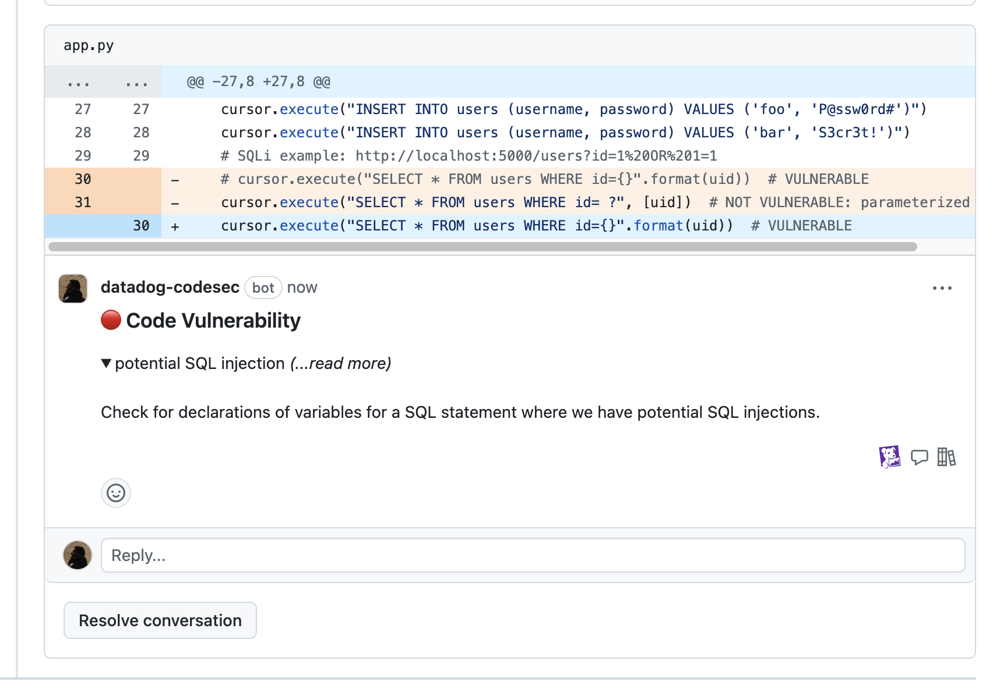
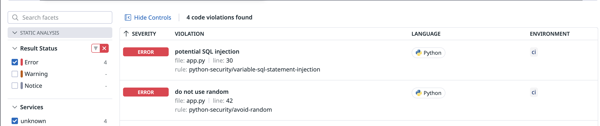
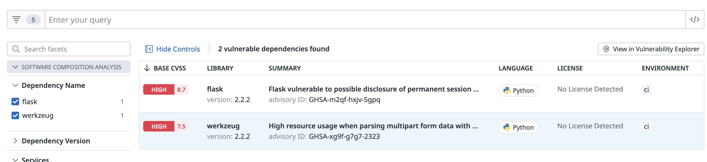
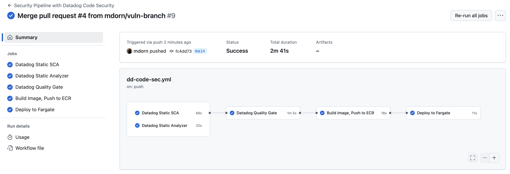
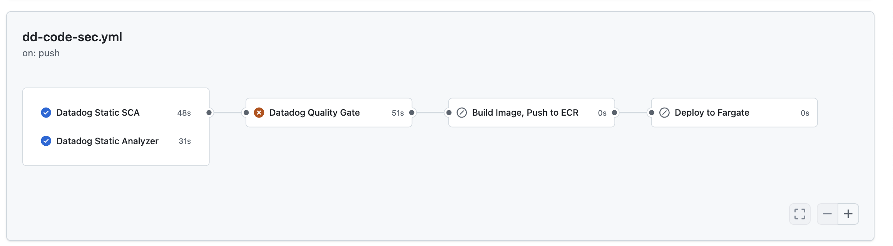
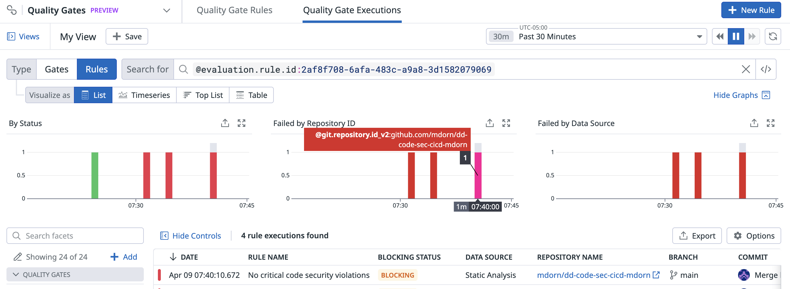

# Datadog Code Security CI/CD Pipeline Tutorial

## Table of Contents

- [Table of Contents](#table-of-contents)
- [Overview](#overview)
- [Prerequisites](#prerequisites)
- [Code repo setup](#code-repo-setup)
   * [Github ](#github)
      + [Repository secrets](#repository-secrets)
      + [Repository variables](#repository-variables)
   * [Datadog ](#datadog)
      + [Github repo integration](#github-repo-integration)
- [Deploy AWS infrastructure and application](#deploy-aws-infrastructure-and-application)
- [Introduce vulnerabilities into application](#introduce-vulnerabilities-into-application)
   * [Create and Merge Pull Request in Github](#create-and-merge-pull-request-in-github)
   * [Confirm vulnerability in running application](#confirm-vulnerability-in-running-application)
   * [Investigate application vulnerabilities in Datadog Code Security console](#investigate-application-vulnerabilities-in-datadog-code-security-console)
- [Restore application without vulnerabilities](#restore-application-without-vulnerabilities)
- [Configure a Quality Gate in Datadog to ensure vulnerable code cannot be deployed](#configure-a-quality-gate-in-datadog-to-ensure-vulnerable-code-cannot-be-deployed)
- [Attempt to reintroduce vulnerabilities into application](#attempt-to-reintroduce-vulnerabilities-into-application)
- [Clean up](#clean-up)

## Overview

This tutorial demonstrates incorporating Datadog Code Security into a CI/CD pipeline (using Github actions) for a Python Flask application running on AWS Fargate with minimal infrastrcuture (an ECR repo and ECS cluster and service with a Fargate task definition will be created).

## Prerequisites

- AWS account
- [Properly configured](https://docs.github.com/en/get-started/onboarding/getting-started-with-your-github-account) Github account - you will be interacting with your forked repo from the command line via `git` so ensure you're set up to do so.
- [Terraform](https://developer.hashicorp.com/terraform/install)
- Optional: [AWS CLI](https://docs.aws.amazon.com/cli/latest/userguide/getting-started-install.html) (useful for debugging connectivity with AWS before running Terraform scripts)

## Code repo setup

### Github 

Fork or [duplicate](https://docs.github.com/en/repositories/creating-and-managing-repositories/duplicating-a-repository) this repo to your Github account and check it out locally.

#### Repository secrets

Add the following key/value pairs to your Github repo, under Settings > Secrets and Variables > Actions

```
AWS_ACCESS_KEY_ID=<your IAM user's access key id>
AWS_SECRET_ACCESS_KEY=<your IAM user's access key secret>
DD_API_KEY=<your Datadog API key>
DD_APP_KEY=<your Datadog application key>
```

#### Repository variables

> NOTE: If you will be deploying into a shared AWS environment, you may want to consider changing the `prefix` variable in `infra/terraform/terraform.tfvars` before the later deployment step to something sure to be unique to avoid name collisions, and change `dd-sec-demo` in the values below to reflect that prefix. If not, you may proceed without changes.  Similarly, you may change `AWS_REGION` but it must correspond to the value in `terraform.tfvars`.

```
AWS_ACCOUNT_ID=<Your AWS Account ID>
AWS_ECR_REPO=dd-sec-demo-repo
AWS_ECS_CLUSTER=dd-sec-demo-cluster
AWS_ECS_SERVICE=dd-sec-demo-service
AWS_REGION=us-east-2
DD_SITE=datadoghq.com
IMAGE_NAME=dd-sec-simple-vuln-app
```

### Datadog 

#### Github repo integration

- Install the Github https://docs.datadoghq.com/integrations/github/ integration and be sure your repo is in scope.
- Configure the app for [GitHub Pull Requests](https://docs.datadoghq.com/security/code_security/dev_tool_int/github_pull_requests/)
- Go to your Github [organization settings](https://github.com/settings/profile) and click "Applications".  For the Datadog Github app, either allow "All repositories" for your account or choose the repo you created for this tutorial.

## Deploy AWS infrastructure and application

The included Terraform code will create an ECR repo and an ECS cluster, service, and task configuration.  The deployment includes a sample container to help ensure the deployment was successful before trying to deploy our application to ECS.

Ensure you're authenticated for appropriate CLI access to your AWS account before running the following.  By default the scripts assume that `AWS_ACCESS_KEY_ID`, `AWS_ACCESS_KEY_SECRET`, and `AWS_REGION` are set.

```sh
cp infra/terraform/terraform.tfvars.sample infra/terraform/terraform.tfvars
# ^^^ Optionally change the values before executing terraform, e.g. prefix and AWS region
terraform -chdir=infra/terraform init
terraform -chdir=infra/terraform apply
# answer "yes" to the prompt
# after a minute or two (the IP may not be immediately available)
FT_IP=`./scripts/get_fargate_task_ip.sh`
curl "http://${FT_IP}:8000"
```

The curl command should produce:

```html
<pre>
Hello World


                                       ##         .
                                 ## ## ##        ==
                              ## ## ## ## ##    ===
                           /""""""""""""""""\___/ ===
                      ~~~ {~~ ~~~~ ~~~ ~~~~ ~~ ~ /  ===- ~~~
                           \______ o          _,/
                            \      \       _,'
                             `'--.._\..--''
</pre>
```

## Introduce vulnerabilities into application

Now we'll introduce vulnerabilities into our application and deploy it.

```sh
git checkout -b clean-branch  # save for later
git checkout -b vuln-branch
git mv .github/workflows/dd-code-sec.yml.DISABLED .github/workflows/dd-code-sec.yml
# introduce SCA vulns first
cp requirements.txt.VULNERABLE requirements.txt
```

In `app.py`, uncomment line 30 and comment line 31 to introduce a SQL Injection vulnerabilty.

```python
cursor.execute("SELECT * FROM users WHERE id={}".format(uid))  # VULNERABLE
# cursor.execute("SELECT * FROM users WHERE id= ?", [uid])  # NOT VULNERABLE: parameterized query
```

(Optionally, there's a vulnerability in another function involving the `random` module that you can introduce as well, to showcase multiple vulnerabilities.)

Also, change `VERSION` in line 6 to `2` to help confirm successful deployment.

Push your changes to the branch:

```sh
git commit -a -m "Introduce vulns"
git push origin vuln-branch
```

### Create and Merge Pull Request in Github

- NOTE: before proceeding, ensure you don't have any Quality Gate rules configured that might be triggered by an action on this repo.
- Observe the automated PR comments and merge it to main branch.  Do NOT delete the branch.



### Confirm vulnerability in running application

Note that after merging the pull request, the Github action deploys the application to your AWS infrastructure.

After the workflow completes:

```sh
# after a minute or two (the IP may not be immediately available):
FT_IP=`./scripts/get_fargate_task_ip.sh`
curl "http://${FT_IP}:5000"
```

The output of the curl command should be:

```
{"app_version":2,"endpoints":["/user?id=","/random"]}
```

Now confirm the app has a SQL injection vulnerability:

```sh
# valid request to app, returns a user record
curl "http://${FT_IP}:5000/user?id=1"
# malicious request to app using SQLi attack returns all records in database
curl "http://${FT_IP}:5000/user?id=1%20OR%201=1"
```

Oh no! App (and library) vulnerabilities have made it into production!

### Investigate application vulnerabilities in Datadog Code Security console

In the Datadog console, go to Security > Code Security > Repositories, click into the repo you connected and note that vulnerabilities were flagged in both your Python application code:



and your third-party libraries:



## Restore application without vulnerabilities

Revert the vulnerabilities you introduced and redeploy the application by first updating our main branch with the clean branch without vulnerabilities.

```sh
git checkout main
git pull origin main
git checkout clean-branch
git merge -s ours main
git checkout main
git merge clean-branch
git push origin main
```

This will trigger the Github workflow to redeploy the application to your AWS infrastructure; the entire Github workflow should successfully complete:



Confirm successful deployment as follows:

```sh
# Note the Fargate task IP will have changed since the last deployment. The redeployment may take a few minutes to complete.
FT_IP=`./scripts/get_fargate_task_ip.sh`
curl "http://${FT_IP}:5000"
```

The output of the curl command should be as follows (note `app_version` is 1):

```
{"app_version":1,"endpoints":["/user?id=","/random"]}
```

Confirm the SQL injection vulnerability has been resolved:

```sh
# valid request to app, returns a user record
curl "http://${FT_IP}:5000/user?id=1"
# malicious request to app should return an harmless response: []
curl "http://${FT_IP}:5000/user?id=1%20OR%201=1"
```

## Configure a Quality Gate in Datadog to ensure vulnerable code cannot be deployed

In the Datadog console, go to Software Delivery > Quality Gates. Create two rules:

### Rule 1: No critical code security violations (SAST)

- Rule type: Static Analysis
- Rule scope: Either choose "always evaluate" or constrain it to your repo.
- Rule conditions: use the default: error >= 1
- Rule name: "No critical code security violations"
- Gate behavior: Blocking

### Rule 2: No dependencies with vulnerabilities (SCA)

- Rule type: SCA
- Rule scope: Either choose "always evaluate" or constrain it to your repo.
- Rule conditions: use the default: critical or high >= 1
- Rule name: "No dependencies with vulnerabilities"
- Gate behavior: Blocking

## Attempt to reintroduce vulnerabilities into application

Merge the `vuln-branch` branch to `main` from the command line and observe the result. (NOTE: This is a shortcut - if desired, alternatively create a new branch (e.g. `vuln-branch-2`) to introduce the vulnerabilities and create a PR in Github, repeating the earlier steps to do this.)

```sh
git checkout main
git pull origin main
git checkout vuln-branch
git merge -s ours main
git checkout main
git merge vuln-branch
git push origin main
```

- Observe in the Github action that the Quality Gate prevents the vulnerable branch from being merged and the application from being with faulty code.



- Observe the automated comments made on the PR.
- Observe in Datadog that the Quality Gate blocked the deployment.



## Clean up

Remove potentially costly AWS infrastructure:

```sh
terraform -chdir=infra/terraform destroy
```

NOTE: ECS task definitions remain, you can delete those manually if desired.
